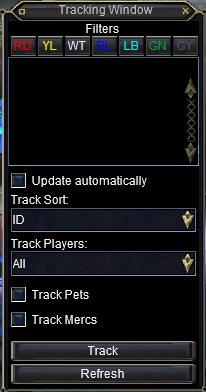

---
tags:
  - plugin
resource_link: "https://www.redguides.com/community/resources/mq2tracking.202/"
support_link: "https://www.redguides.com/community/threads/mq2tracking.66896/"
repository: "https://github.com/RedGuides/MQ2Tracking"
config: "MQ2Tracking.ini"
authors: "Redbot, MacroFiend, Kallo"
tagline: "Provides a similar tracking window to the one used by native tracking characters."
---

# MQ2Tracking

<!--desc-start-->
Provides a similar tracking window to the one used by native tracking characters.
<!--desc-end-->


## Commands

<a href="cmd-track/">

</a>
:     {{ readMore('projects/mq2tracking/cmd-track.md') }}

<a href="cmd-tracknames/">

</a>
:     {{ readMore('projects/mq2tracking/cmd-tracknames.md') }}

## Settings

The MQ2Tracking configuration file, basic example, is show below;

```ini
[Settings]
ChatTop=357
ChatBottom=620
ChatLeft=164
ChatRight=375
Locked=0
Fades=1
Delay=2000
Duration=500
Alpha=255
FadeToAlpha=255
BGType=1
BGTint=4278190080
TrackDistance=75
DisplayTpl=[%l %C] %N (%R)
AutoRefresh=0
RefreshDelay=60
[Filters]
ShowRed=0
ShowYellow=0
ShowWhite=0
ShowBlue=0
ShowLBlue=0
ShowGreen=0
ShowGray=0
Players=0
Sort=0
```
